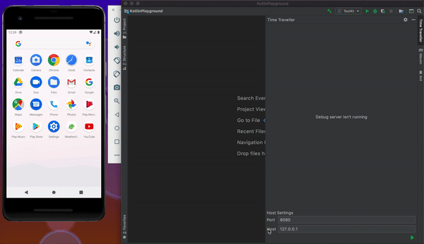

[](https://mvnrepository.com/artifact/io.github.xlopec/tea-core)
[](https://plugins.jetbrains.com/plugin/14254-time-travel-debugger)

# TEA Bag


Tea Bag is a simple implementation of [TEA](https://guide.elm-lang.org/architecture/)
architecture written in Kotlin. This library is based on Kotlin's coroutines, extensively uses
extension-based approach and supports both ```jvm``` and ```ios``` targets.

This library isn't production ready yet and was originally intended as pet project to give TEA a
try. Later I found that it'd be nice to make it simpler and more lightweight than analogs, add
debugging capabilities...

## Quick Sample

Nothing special, we just need to code our initializer, resolver (`tracker` function),
updater (`computeNewState`function), and UI (`renderSnapshot,` function). After that we should pass
them to an appropriate `Component` builder overload.

```kotlin
@file:OptIn(ExperimentalTeaApi::class)

package io.github.xlopec.counter

import io.github.xlopec.tea.core.*
import kotlinx.coroutines.runBlocking

/**Async initializer, provides initial state*/
suspend fun initializer(): Initial<Int, Int> = Initial(0)

/**Some tracker*/
fun track(
  event: Snapshot<Int, Int, Int>,
  ctx: ResolveCtx<Int>,
) {
  ctx sideEffect { println("Track: \"$event\"") }
}

/**App logic, for now it just adds delta to count and returns this as result*/
fun add(
  delta: Int,
  counter: Int,
): Update<Int, Int> = (counter + delta) command delta

/**Some UI, e.g. console*/
suspend fun display(
  snapshot: Snapshot<*, *, *>,
) {
  println("Display: $snapshot")
}

fun main() = runBlocking {
  // Somewhere at the application level
  val component = Component(
    initializer = ::initializer,
    resolver = ::track,
    updater = ::add,
    scope = this,
  )
  // UI = component([message1, message2, ..., message N])
  component(+1, +2, -3).collect(::display)
}
```

The sample above will print the following:

```text
Display: Initial(currentState=0, commands=[])
Track: "Regular(currentState=1, commands=[1], previousState=0, message=1)"
Track: "Initial(currentState=0, commands=[])"
Track: "Regular(currentState=3, commands=[2], previousState=1, message=2)"
Track: "Regular(currentState=0, commands=[-3], previousState=3, message=-3)"
Display: Regular(currentState=1, commands=[1], previousState=0, message=1)
Display: Regular(currentState=3, commands=[2], previousState=1, message=2)
Display: Regular(currentState=0, commands=[-3], previousState=3, message=-3)
```

Real world examples include [Android](https://github.com/Xlopec/Tea-bag/tree/master/samples/app) and
[IOS](https://github.com/Xlopec/Tea-bag/tree/master/samples/iosApp) app samples that use the same application component 
and share common entities, application and navigation logic.
[Intellij plugin](https://github.com/Xlopec/Tea-bag/tree/master/tea-time-travel-plugin) is built on the top of the library
as well.

For more info visit [Wiki](https://github.com/Xlopec/Tea-bag/wiki) page

## Main Features

- **Multiplatform** this library supports ```jvm```, ```iosX64``` and ```iosArm64``` targets
- **Scalability** it is build on the top of a simple idea of having pure functions that operate on
  plain data separated from impure one. Those functions are building blocks and form testable
  components that can be combined to build complex applications
- **Simplicity** component implementation resides in a single file
- **Extensibility** additional functionality and API is implemented as component extensions which
  means you can easily add your own
- **Debugger** [Intellij debugger plugin](https://plugins.jetbrains.com/plugin/14254-time-travel-debugger)
  is available for this library, though it's not production ready yet

## Gradle

Add the dependency:

```kotlin
implementation("io.github.xlopec:tea-core:[version]")
implementation("io.github.xlopec:tea-time-travel:[version]")
implementation("io.github.xlopec:tea-time-travel-adapter-gson:[version]")
```

Make sure that you have `mavenCentral()` in the list of repositories.

## Plugin

<p align="center">
  
</p>

Plugin is available on [JetBrains marketplace](https://plugins.jetbrains.com/plugin/14254-time-travel-debugger)

## Main Modules

- **tea-core** - contains core types along with basic component implementation
- **tea-time-travel** - contains debuggable version of the component
- **tea-time-travel-adapter-gson** - implements debug protocol and serialization by means
  of [Gson](https://github.com/google/gson) library. Should be added as dependency together with **tea-time-travel** module
- **tea-time-travel-protocol** - contains debug protocol types definitions
- **tea-time-travel-plugin** - contains Intellij plugin implementation

## How to build and run

To build plugin from sources use ```./gradlew tea-time-travel-plugin:buildPlugin``` command.
Installable plugin will be located in ```tea-time-travel-plugin/build/distributions``` directory.

To run Intellij Idea with installed plugin use ```./gradlew tea-time-travel-plugin:runIde```
command.

To build android app sample run ```./gradlew :samples:app:assembleDefaultDebug``` or ```./gradlew :samples:app:assembleRemoteDebug```.
The last command assembles debuggable version on of the application that connects to the currently running instance of 
debugger (will try connecting to http://localhost:8080).

## Planned features and TODOs

- Re-implement client-server communication protocol from scratch
- Migrate from gson to `kotlinx.serialization.json`
- Release v1.0.0
- Add GitHub Wiki
- Rework component builders and possibly replace it with some kind of DSL
- Add keyboard shortcuts for plugin, consider improving plugin UX

## Contribution

Contributions are more than welcome. If something cannot be done, not convenient, or does not work -
create an issue or PR  
